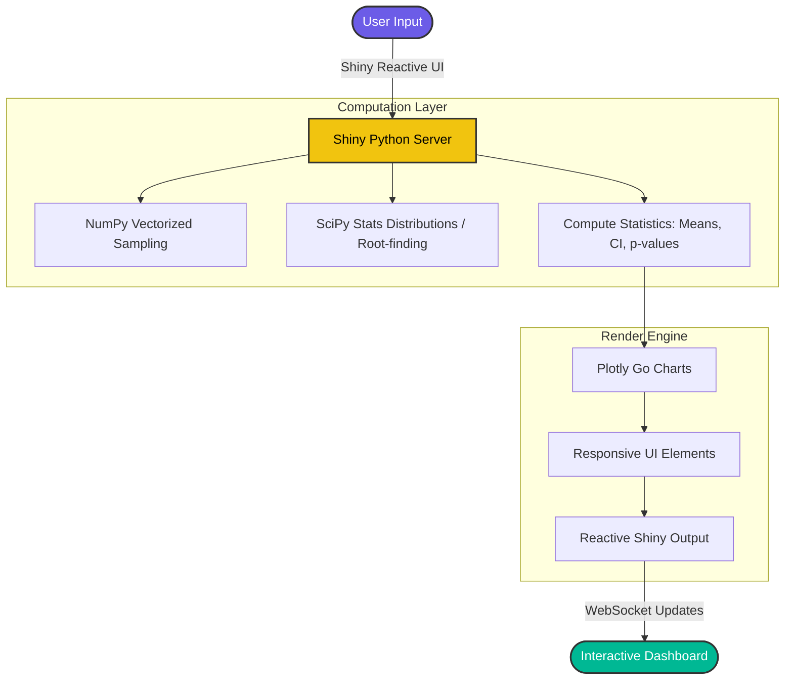

<div align="center">
  
</div>

# Prob Lab 🧙‍♂️📊

*“One Distribution to rule them all, One Interval to find them, One Test to bring them all and in the data bind them.”*

**Prob Lab** is an interactive educational platform for exploring probability theory, statistical inference, and hypothesis testing through dynamic simulation. 
Built with **Shiny for Python** and **Plotly**, optimized for both desktop and mobile, and containerized with Docker.

## 🗺️ The Realms of Analysis (Modules)

Prob Lab consists of three deeply interactive modules designed to correct common statistical misconceptions through real-time sampling and visualization.

### 🏹 1. CI Explorer (The Quest for the True Parameter)
Visualize the mechanics of confidence intervals and the Central Limit Theorem. Watch how intervals behave under different population distributions and methodologies.

* **Key Features:**
  * **6 Probability Distributions:** Normal, Uniform, Exponential, Log-normal, Poisson, and Binomial.
  * **Multiple Formulas:** Estimate Mean, Median, Variance, Percentiles, and Proportions.
  * **Robust CI Methods:** Classical (t, z), rigorous exact methods for proportions (Wald, Wilson, Clopper-Pearson), and **Bootstrap** (percentile, B=500) for non-parametric statistics.
  * **Live Visualizations:** Track the proportion of intervals successfully catching the true parameter (like capturing the Ring) dynamically as samples grow.

### 👁️ 2. p-value Explorer (Piercing the Shadows)
Simulate hypothesis testing repeatedly to watch the accumulation of *p*-values and understand Type I/Type II errors under the hood.

* **Key Features:**
  * **Interactive Testing:** One-sample, Two-sample (Independent), and Paired tests ($t$-test and $z$-test).
  * **Outlier Injection:** Vulnerability testing! Easily inject outliers via a customized slider to see how parametric tests randomly break and lose power (like the unpredictable influence of a corrupted variable).
  * **Complete Control:** Dial your True $\mu$, Null $\mu_0$, Sample Size, and $\alpha$ to immediately see the Null vs. Alternative distribution overlaps.

### ⚔️ 3. Power Explorer (Gathering the Forces)
Master A/B testing design. Calculate and understand the complex relationship between Effect Size (Cohen's $d$), Sample Size ($n$), Significance level ($\alpha$), and Statistical Power ($1-\beta$). *Is your sample army large enough to detect the signal?*

* **Key Features:**
  * **"Solve For" Architecture:** Lock any three parameters and the system dynamically root-finds the fourth (e.g., solve for required $n$ to achieve 80% power).
  * **Smart Grouping:** Seamlessly groups Sample Sizes ($n_1$ and $n_2$) specifically for independent two-sample tests.
  * **Power Curves:** A dynamic curve updates in real-time, mapping exactly where your current experimental design sits on the power trajectory.
  * **Preset Scenarios:** Pre-loaded settings for generic A/B Tests, Clinical Trials, and Psychology Studies.

## 📜 The Magic Flow (Architecture)



## 🛠️ Tech Stack

- **Framework:** [Shiny for Python](https://shiny.posit.co/py/)
- **Visuals:** [Plotly](https://plotly.com/python/) (Interactive, HTML-embedded, MathJax integrated)
- **Math Engine:** [NumPy](https://numpy.org/) & [SciPy](https://scipy.org/)
- **Deploy:** Docker & Hugging Face Spaces

## 🚀 Run Locally

Ensure you have [uv](https://github.com/astral-sh/uv) installed to manage the Python environment.

```bash
# 1. Sync dependencies
uv sync

# 2. Run the Shiny app
shiny run app.py --host 0.0.0.0 --port 7860
```

Alternatively, run completely isolated via **Docker**:

```bash
docker build -t prob-lab .
docker run -p 7860:7860 prob-lab
```
